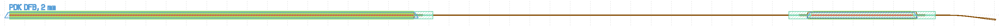
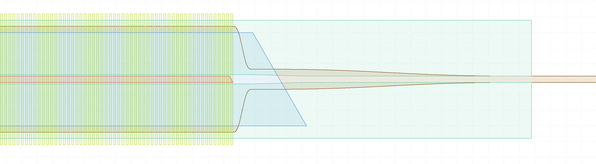
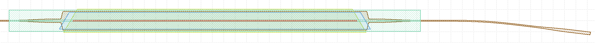

# photonics-pdk


## Description

A utility package and PDK for a custom GaAs process, for use with the [nazca-degin](https://nazca-design.org/) GDS layout library. My [nazca fork with fixes](https://github.com/nickersonm/nazca-design) will be most compatible. KLayout scripts for postprocessing the nazca output are also included.


## Install

Clone this repository and add it to your Python PATH.

### Dependencies

- The [nazca-degin](https://nazca-design.org/) GDS layout library is the primary dependency. My [nazca fork with fixes](https://github.com/nickersonm/nazca-design) will be most compatible.
- numpy
- [gdstk](https://heitzmann.github.io/gdstk/reference_python.html) is used in `pdk_Fab6\pdk_05_functions.py` for additional speed, but can be replaced with nazca's `clipper` functions in the appropriate sections.
- [KLayout](https://www.klayout.de) is needed for some postprocessing. A [KLayout technology file](https://www.klayout.de/doc/about/technology_manager.html) is also [provided in the `pdk_Fab6/`](./pdk_Fab6/Fab6.lyp) folder for viewing.


## Usage

Sample mask definition files are provided in [`samples/`](./samples/). Make sure to set the KLayout path on the last line.

Use the utility package or PDK by importing them after nazca:

```python
import nazca
import pdk_Fab6 as PDK
```

Then use any component as desired. Lengths are in microns, as in nazca.

```python
with nazca.Cell(name='DFB') as cellDFB:
    PDK.inputLabel(text='PDK DFB, 2 mm', xs=None).put(50,0) # xs=None to avoid putting an input waveguide
    PDK.deviceDFB(length=2e3).put()
    PDK.soaToOut(x=5e3, soalen=500, angle=7).put()   # Straight waveguide to output at 5 mm border, with 500 µm SOA before 7° angled output
```

Generate the GDS with nazca, then postprocess with the provided KLayout scripts - **make sure to insert the appropriate KLayout path in the last line if it is not available via the system PATH**:

```python
dieFile = 'demo_mask.gds'
nazca.export_gds(topcells=cellDFB, filename=dieFile, clear=False)

# Postprocess with KLayout
print('Postprocessing with KLayout...')
from subprocess import call
from os.path import abspath
postDRC = [abspath('..\\pdk_Fab6\\Fab6_postprocess.lydrc'),
           abspath('..\\pdk_Fab6\\Fab6_postprocess_merge.lydrc')]
for drc in postDRC:
    call(['klayout_app', '-b', '-r', drc, '-rd', 'input='+abspath(dieFile)])
```

This produces an OASIS file with a 2 mm long gain-coupled DFB followed by a waveguide and a 500 µm long SOA:



This includes gain-coupled stripes on the DFB, shallow-deep transitions out of the DFB and on both sides of the SOA, and an angled output with spot-size converter after the SOA:





## Utility Package

The `marks_NanoFab` package includes several utility marks for [lithography tools](https://wiki.nanotech.ucsb.edu/wiki/Tool_List#Lithography) in the [UCSB NanoFab](https://www.nanotech.ucsb.edu), as well as several utility functions.

Documentation is available in the [`docs/`](./docs/marks_NanoFab/) folder and in the [individual functions](./marks_NanoFab/).


## PDK Contents

The `pdk_Fab6` package contains a number of PDK elements for an active-passive GaAs process, as well as several functions that are helpful for making more complex masks.

Documentation is available in the [`docs/`](./docs/pdk_Fab6/) folder and in the [individual functions](./pdk_Fab6/).

Samples using the PDK are available in the [samples folder](./samples/).
